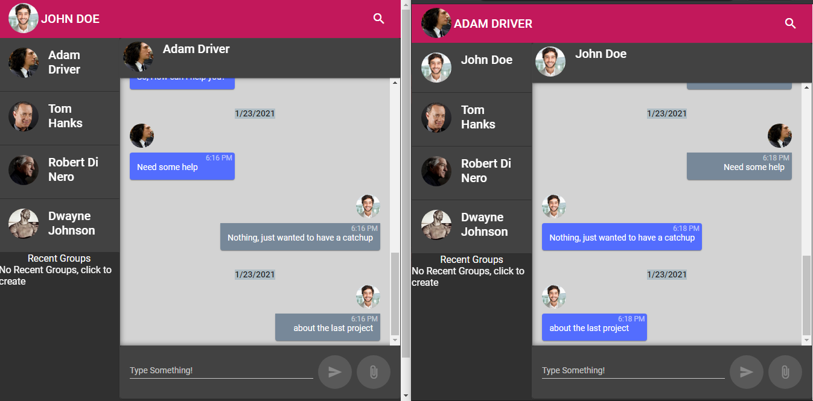

# Node Chat App
Project uses NodeJS as a backend server powered by [socket.io](https://socket.io/) and Angular Material for frontend.

- Current Features
	- One to One Chat
	- Capturing Typing events	
  - Offline messages
	- File sharing
	- Group Chat (currently working)

## Setup
Run `npm install`

## Start Node Server
Run `node server.js` by default listens to port `3000`

## Start Angular Development Server
Run `npm start` Navigate to `http://localhost:4200/`.
